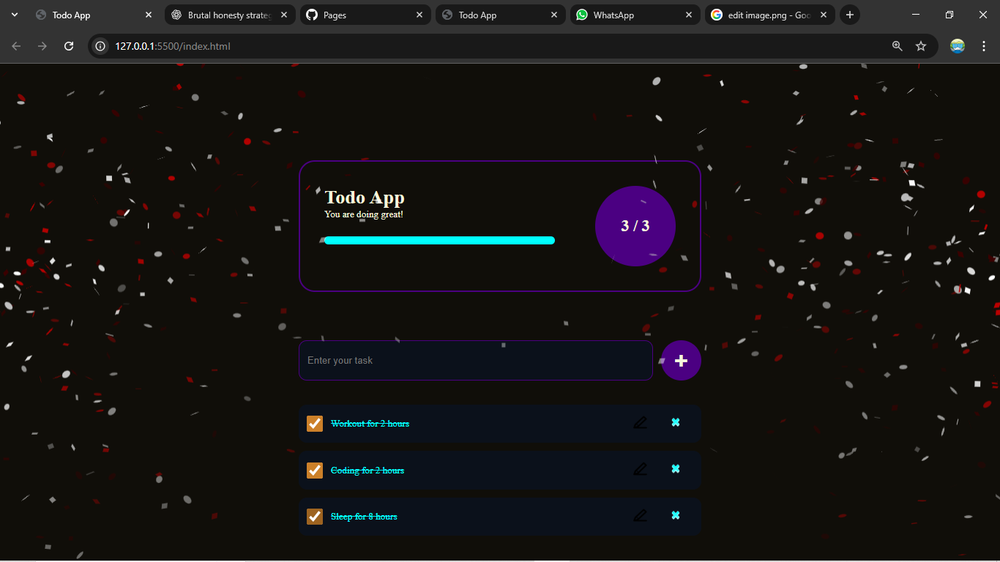
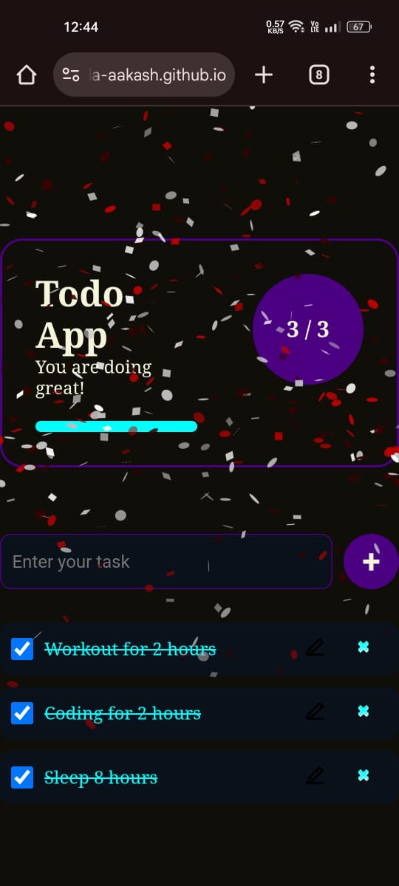

🚀 Todo App – A Clean, Fast & Polished Task Manager

A minimal, fast, and surprisingly polished Todo App built with pure HTML, CSS, and Vanilla JavaScript — no frameworks, no shortcuts.

This project proves one thing:

👉 You don’t need React to write clean UI + state logic. You just need discipline.

The app features smooth UX, localStorage persistence, live progress tracking, and a confetti celebration when the user completes all tasks.

🌟 Features That Actually Matter

✔️ Add tasks
✔️ Mark tasks as completed
✔️ Edit tasks
✔️ Delete tasks
✔️ Persistent storage using localStorage
✔️ Dynamic progress bar
✔️ Auto-saved state
✔️ Confetti explosion when all tasks are completed
✔️ Mobile-friendly responsive UI
✔️ Clear, readable code with real DOM manipulation
✔️ Lightweight: 0 libraries (except confetti)

🎥 Live Demo

👉 https://gugilla-aakash.github.io/todo-app/

📸 Screenshots
Desktop

Mobile View

🧠 What I Learned Building This

How to structure a real project without frameworks

How to manage UI state cleanly using plain JS

How to sync DOM updates with data structures

How to properly use localStorage for persistence

How to write readable, modular, bug-resistant logic

How to isolate UI rendering functions

How to polish a small project to make it portfolio-worthy

This wasn’t “tutorial coding.”
This was actual problem-solving, edge-case handling, and polishing.

🛠️ Tech Stack

HTML5

CSS3

JavaScript (Vanilla)

localStorage API

tsParticles Confetti

⚡ Run Locally
# Clone the repository
git clone https://github.com/Gugilla-Aakash/todo-app.git

# Open the folder
cd todo-app

# Open index.html in your browser
# (Or use Live Server in VS Code)

No build step. No dependencies. Just open & run.

📂 Project Structure
todo-app/
│── index.html
│── styles.css
│── app.js
│── README.md
│── .gitignore
│── docs/
│     └── demo.gif
|── screenshots/
      ├── desktop.png
      └── mobile.jpeg
│── img/
      ├── edit.png
      └── clear.png

🚀 Future Improvements

Light/Dark mode toggle

Drag & Drop task reordering

Filters: All / Active / Completed

Cloud sync

Task categories

⭐ Why This Project Is Portfolio-Ready

Because it shows:

You finish projects

You polish UI

You understand DOM deeply

You handle edge cases

You think about UX

You don’t rely on frameworks as a crutch

You write clean, structured code

This puts you in the top 10% of beginners who actually build instead of consuming tutorials.

🤝 Contributing

Pull requests welcome.
Open an issue if you have ideas or find bugs.

📜 License

MIT License.